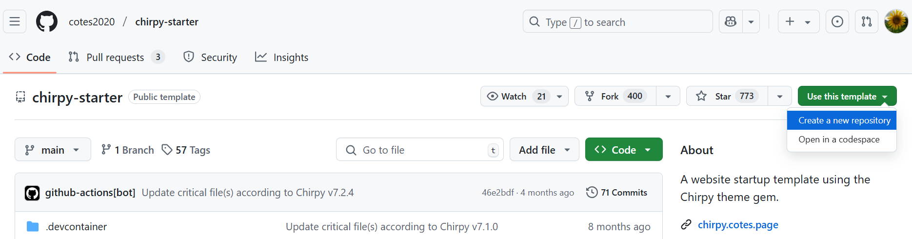
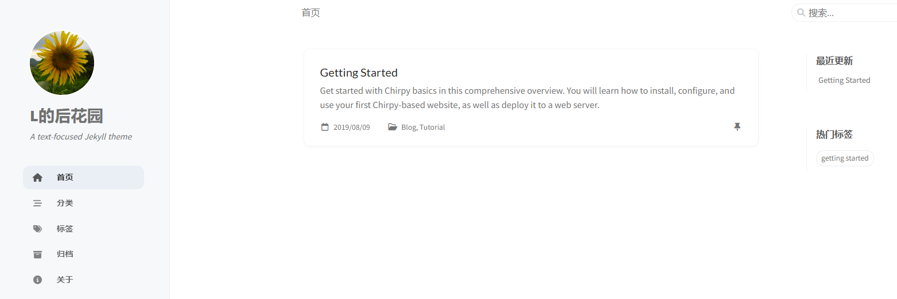

## **介绍**

Jekyll 是一个静态站点生成器，内置 GitHub Pages 支持和简化的构建过程。 Jekyll 使用 Markdown 和 HTML 文件，并根据选择的布局创建完整静态网站。

Jekyll Chirpy 主题是一个基于 Jekyll 的博客主题，它提供了很多功能，比如文章分类、标签、评论、搜索、分页等。

有两种使用 Jekyll Chirpy 主题的方式，最少配置使用 [chirpy-starter](https://github.com/cotes2020/chirpy-starter) ，需要定制功能、UI 使用 [jekyll-theme-chirpy](https://github.com/cotes2020/jekyll-theme-chirpy)
。

本文采用的是 chirpy-starter 的方式。


## **操作步骤**

### 1.创建站点存储库

基于 [chirpy-starter](https://github.com/cotes2020/chirpy-starter) 创建站点存储库，存储库的名字为 "panhuida.github.io"





### 2.配置 GitHub Actions

在存储库  "panhuida.github.io" 的设置中，选择 "Pages"， 将 "Build and deployment" 的 Source 选择为 "GitHub Actions"

https://github.com/panhuida/panhuida.github.io/settings/pages


### 3.简单配置

将 存储库  "panhuida.github.io"  克隆到本地，修改 _config.yml 文件，然后运行提交修改，github page服务会自动更新博客内容。

（1）存储库  "panhuida.github.io"  克隆到本地

```shell
E:\study\study\github>git clone https://github.com/panhuida/panhuida.github.io.git
Cloning into 'panhuida.github.io'...
remote: Enumerating objects: 37, done.
remote: Counting objects: 100% (37/37), done.
remote: Compressing objects: 100% (29/29), done.
remote: Total 37 (delta 0), reused 26 (delta 0), pack-reused 0 (from 0)
Receiving objects: 100% (37/37), 12.31 KiB | 393.00 KiB/s, done.
```

（2）_config.yml 文件

```yaml
url: "https://panhuida.github.io"
lang: zh-CN
timezone: Asia/Shanghai
title: L的后花园 # the main title
tagline: A text-focused Jekyll theme # it will display as the subtitle
avatar: /assets/img/avatar.jpg
```

配置之后，提交修改，访问 https://panhuida.github.io/ 可以看到效果了。


### 4.写博客

博客文章一般放在_posts文件夹中，文件名格式为YYYY-MM-DD-title.md，其中YYYY-MM-DD为发布日期，title为文章标题，.md为文件后缀。

```yaml
---
title: Your Blog Title
categories: [Category1, Category2]
tags: [Tag1, Tag2]
pin: true # 置顶文章
toc: true # 目录
comments: true # 评论
---

# Your Blog Title

This is your first blog post.
```

`categories`和`tags`为文章分类和标签，`pin`为置顶文章，`toc`为目录，`comments`为评论。

(

https://chatgpt.com/c/680b0318-2c08-8012-a44b-e4cd7e5a4323

在给定的 markdown 内容中，`---` 用作 **front matter**（前置元数据）与主要内容之间的分隔符。

**Front matter** 是一种放置在 markdown 文件顶部的元数据块，通常采用 YAML 格式。这个部分包含了关于文档的额外信息，比如标题、描述、作者、日期等。它帮助提供文档的背景信息，或者控制静态网站生成器（如 Jekyll、Hugo）如何处理该 markdown 文件。

--- 标记了 front matter 部分的开始和结束。在 --- 后面的部分则是 markdown 文档的实际内容。

在 YAML 中，`>-` 是一种 **折叠块文字** 的标记方式，用来处理长文本内容。具体来说，`>-` 用于将多行的文本合并为一行，去除其中的换行符，但保留段落之间的空格。

解释：

- `>` 表示将多行文本折叠成一行，在显示时会去掉换行符，但会保留段落间的空行。
- `-` 进一步处理，去除文本末尾的空白行。

)


#### 示例

如从 https://chirpy.cotes.page/ 对应的 存储库 https://github.com/cotes2020/jekyll-theme-chirpy 中复制 Getting Started 这边文章。

文章示例

- 去掉"media_subpath: '/posts/20180809'"，这个是文章图片中的来源目录
- 将文章中图片的来源路径改为本地路径"/assets/img/pages-source-light.png"，其中"/"代表本地项目文件夹的根目录

```shell
---
title: Getting Started
description: >-
  Get started with Chirpy basics in this comprehensive overview.
  You will learn how to install, configure, and use your first Chirpy-based website, as well as deploy it to a web server.
author: cotes
date: 2019-08-09 20:55:00 +0800
categories: [Blog, Tutorial]
tags: [getting started]
pin: true
---
```

输出示例




### 5.设置评论功能

https://wayfare11.github.io/posts/build-blog-on-github/#写评论

https://www.lixueduan.com/posts/blog/02-add-giscus-comment/


### 6.设置本地开发环境

（1）操作步骤

- 安装 Docker Desktop

- 安装 VS Code 及 Dev Containers 扩展 

  使用 VS Code 打开 panhuida.github.io 代码库，会提示安装 Dev Containers 扩展；安装 Dev Containers 扩展 后，会提示“在卷中克隆”  


- 选择"在卷中克隆"


（2）本地调试

https://chirpy.cotes.page/posts/getting-started/#setting-up-the-environment

使用VScode，在仓库的根目录，打开终端，执行命令 `bundle exec jekyll s`。

```shell
vscode ➜ /workspaces/panhuida.github.io (main) $  bundle exec jekyll s 
Configuration file: /workspaces/panhuida.github.io/_config.yml
            Source: /workspaces/panhuida.github.io
       Destination: /workspaces/panhuida.github.io/_site
 Incremental build: disabled. Enable with --incremental
      Generating... 
                    done in 0.607 seconds.
 Auto-regeneration: enabled for '/workspaces/panhuida.github.io'
    Server address: http://127.0.0.1:4000/
  Server running... press ctrl-c to stop.
```

打开浏览器，进入http://127.0.0.1:4000/ 就可以看到自己的网站了


## **参考资料**

Jekyll Chirpy 主题官方网站及代码库

https://chirpy.cotes.page/posts/getting-started/

https://github.com/cotes2020/chirpy-starter

wayfare11 的博客

https://wayfare11.github.io/posts/build-blog-on-github/

https://github.com/wayfare11/wayfare11.github.io

使用Github Pages搭建个人主页or博客网站

https://zhuanlan.zhihu.com/p/641525444

https://zhuanlan.zhihu.com/p/695291923

爆赞的博客主题分享，值得一看

https://mp.weixin.qq.com/s/Pm8MXHB_cPQ2rCKyhog_XA
